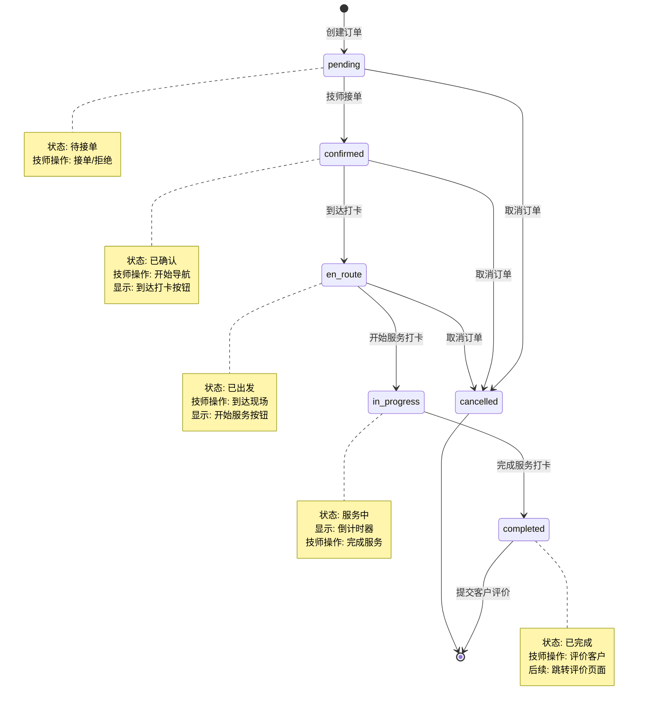
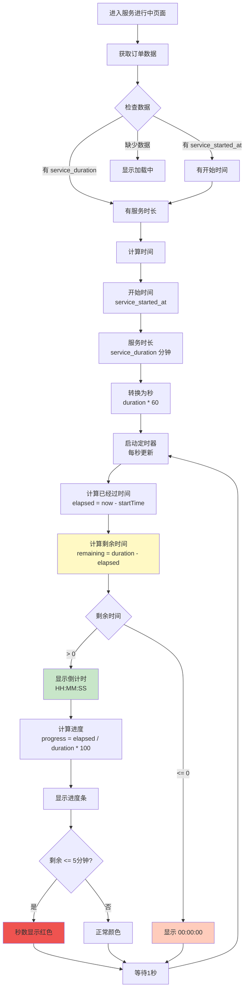
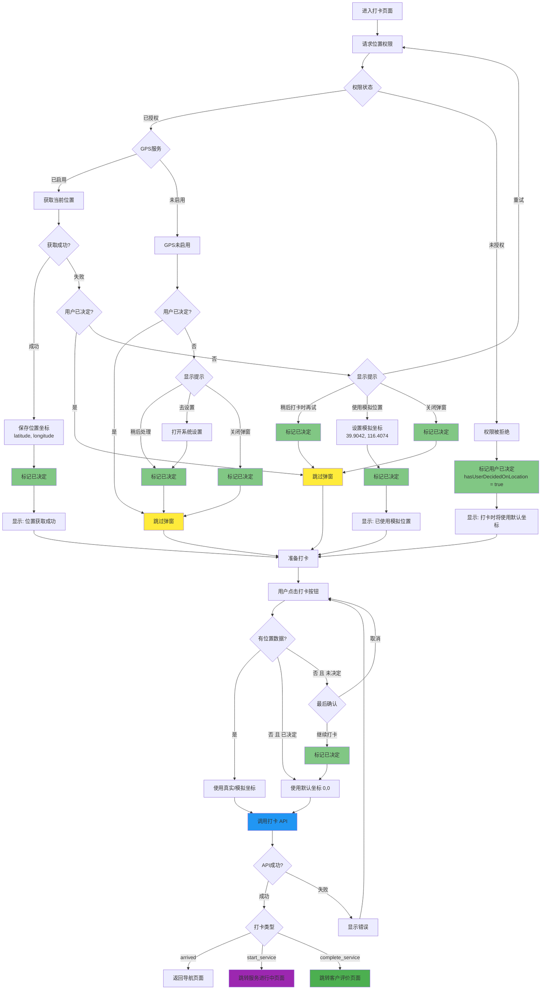

# 技师服务完整流程图

## 📱 主流程图

```mermaid
graph TB
    Start[订单列表页面<br/>OrdersScreen] --> CheckStatus{订单状态}
    
    CheckStatus -->|pending 待接单| Accept[点击接单按钮]
    CheckStatus -->|confirmed 已确认| Navigate1[点击开始导航]
    CheckStatus -->|en_route 已出发| Navigate2[导航页面]
    CheckStatus -->|in_progress 服务中| InProgress[服务进行中页面]
    CheckStatus -->|completed 已完成| Completed[显示已完成]
    
    Accept --> Accepted{接单成功?}
    Accepted -->|是| OrderDetails[订单详情页<br/>OrderDetailsScreen]
    Accepted -->|否| Start
    
    OrderDetails --> Navigate1
    
    Navigate1 --> NavScreen[导航页面<br/>NavigationScreen]
    Navigate2 --> NavScreen
    
    NavScreen --> NavStatus{当前步骤}
    
    NavStatus -->|步骤1: 已确认| ArriveBtn[显示到达打卡按钮]
    NavStatus -->|步骤2: 已出发| StartBtn[显示开始服务按钮]
    NavStatus -->|步骤3: 服务中| CompleteBtn[显示完成服务按钮]
    
    ArriveBtn --> ClickArrive[点击到达打卡]
    ClickArrive --> CheckIn1[打卡页面<br/>CheckInScreen<br/>type: arrived]
    
    CheckIn1 --> GetLocation1{获取位置}
    GetLocation1 -->|成功| Checkin1Success[打卡成功<br/>状态: confirmed → en_route]
    GetLocation1 -->|失败| LocationPrompt1{用户选择}
    LocationPrompt1 -->|使用模拟位置| Checkin1Success
    LocationPrompt1 -->|继续打卡| Checkin1Success
    LocationPrompt1 -->|稍后处理| CheckIn1
    
    Checkin1Success --> BackToNav1[返回导航页面]
    BackToNav1 --> NavScreen
    
    StartBtn --> ClickStart[点击开始服务]
    ClickStart --> CheckIn2[打卡页面<br/>CheckInScreen<br/>type: start]
    
    CheckIn2 --> GetLocation2{获取位置}
    GetLocation2 -->|成功| Checkin2Success[打卡成功<br/>状态: en_route → in_progress]
    GetLocation2 -->|失败| LocationPrompt2{用户选择}
    LocationPrompt2 -->|使用模拟位置| Checkin2Success
    LocationPrompt2 -->|继续打卡| Checkin2Success
    LocationPrompt2 -->|稍后处理| CheckIn2
    
    Checkin2Success --> ServiceInProgress[服务进行中页面<br/>ServiceInProgressScreen]
    
    ServiceInProgress --> ShowTimer[显示倒计时<br/>基于订单服务时长]
    ShowTimer --> TimerRunning{倒计时中}
    TimerRunning -->|时间充足| ShowProgress[显示进度条和剩余时间]
    TimerRunning -->|少于5分钟| ShowWarning[秒数显示红色警告]
    TimerRunning -->|时间到| TimeUp[00:00:00]
    
    ShowProgress --> UserAction1{用户操作}
    ShowWarning --> UserAction1
    TimeUp --> UserAction1
    
    UserAction1 -->|点击完成服务| ClickComplete[点击完成服务打卡]
    UserAction1 -->|继续服务| ShowTimer
    
    CompleteBtn --> ClickComplete2[点击完成服务]
    ClickComplete --> CheckIn3[打卡页面<br/>CheckInScreen<br/>type: complete]
    ClickComplete2 --> CheckIn3
    
    CheckIn3 --> GetLocation3{获取位置}
    GetLocation3 -->|成功| Checkin3Success[打卡成功<br/>状态: in_progress → completed]
    GetLocation3 -->|失败| LocationPrompt3{用户选择}
    LocationPrompt3 -->|使用模拟位置| Checkin3Success
    LocationPrompt3 -->|继续打卡| Checkin3Success
    LocationPrompt3 -->|稍后处理| CheckIn3
    
    Checkin3Success --> CustomerFeedback[客户评价页面<br/>CustomerFeedbackScreen]
    
    CustomerFeedback --> FillReview[填写评价]
    FillReview --> Rating[1. 选择星级评分 1-5星]
    Rating --> Tags[2. 选择快速标签 多选]
    Tags --> Note[3. 填写私密备注 可选]
    Note --> Submit[点击提交反馈]
    
    Submit --> SaveReview{保存到数据库}
    SaveReview -->|成功| ShowSuccess[显示成功提示]
    SaveReview -->|失败| ShowError[显示错误提示]
    
    ShowSuccess --> BackToHome[返回订单首页]
    ShowError --> CustomerFeedback
    
    BackToHome --> Start
    
    style Start fill:#e1f5fe
    style NavScreen fill:#fff9c4
    style ServiceInProgress fill:#f3e5f5
    style CustomerFeedback fill:#c8e6c9
    style CheckIn1 fill:#ffccbc
    style CheckIn2 fill:#ffccbc
    style CheckIn3 fill:#ffccbc
    style Checkin1Success fill:#81c784
    style Checkin2Success fill:#81c784
    style Checkin3Success fill:#81c784
    style ShowWarning fill:#ef5350
    style TimeUp fill:#ef5350
    style BackToHome fill:#4caf50
```



## 📊 订单状态流转图



## ⏱️ 倒计时逻辑流程图



## 🗺️ 位置获取流程图



## 💾 数据库操作流程图

```mermaid
graph TB
    CompleteCheckin[完成服务打卡成功] --> NavToFeedback[导航到评价页面<br/>传递订单信息]
    
    NavToFeedback --> LoadOrderData[加载订单数据<br/>orderId, customerName, etc.]
    LoadOrderData --> ShowForm[显示评价表单]
    
    ShowForm --> UserFill[用户填写]
    UserFill --> InputRating[选择评分 1-5星]
    InputRating --> InputTags[选择标签 多选]
    InputTags --> InputNote[填写备注 可选]
    InputNote --> ClickSubmit[点击提交]
    
    ClickSubmit --> Validate{验证}
    Validate -->|评分为0| ShowRatingError[提示: 请选择评分]
    Validate -->|通过| PrepareData[准备数据]
    
    ShowRatingError --> UserFill
    
    PrepareData --> CreateRequest[创建请求对象<br/>CustomerReviewCreateRequest]
    CreateRequest --> RequestData{请求数据}
    
    RequestData --> Rating[rating: number]
    RequestData --> Tags[tags: string[] or undefined]
    RequestData --> Note[private_note: string or undefined]
    
    Rating --> CallAPI[调用 API<br/>POST /therapist/orders/{id}/customer-review]
    Tags --> CallAPI
    Note --> CallAPI
    
    CallAPI --> Backend[后端接收请求]
    
    Backend --> Verify1[1. 验证订单存在]
    Verify1 --> Verify2[2. 验证订单属于该技师]
    Verify2 --> Verify3[3. 验证订单已完成]
    Verify3 --> Verify4[4. 检查是否已评价过]
    
    Verify4 --> CheckResult{验证结果}
    CheckResult -->|失败| ReturnError[返回错误]
    CheckResult -->|成功| CreateRecord[创建评价记录]
    
    CreateRecord --> InsertDB[INSERT INTO<br/>therapist_customer_reviews]
    
    InsertDB --> DBData{数据库字段}
    DBData --> Field1[therapist_id: 评价者]
    DBData --> Field2[user_id: 被评价的客户]
    DBData --> Field3[booking_id: 关联订单 UNIQUE]
    DBData --> Field4[rating: 1-5星]
    DBData --> Field5[tags: JSON数组]
    DBData --> Field6[private_note: TEXT]
    DBData --> Field7[created_at: timestamp]
    
    Field1 --> CommitTX[提交事务]
    Field2 --> CommitTX
    Field3 --> CommitTX
    Field4 --> CommitTX
    Field5 --> CommitTX
    Field6 --> CommitTX
    Field7 --> CommitTX
    
    CommitTX --> ReturnSuccess[返回成功响应]
    
    ReturnError --> FrontendError[前端显示错误]
    ReturnSuccess --> FrontendSuccess[前端显示成功]
    
    FrontendError --> ShowForm
    FrontendSuccess --> ShowSnackbar[显示 Snackbar<br/>评价提交成功]
    
    ShowSnackbar --> Wait[等待 1.5 秒]
    Wait --> ResetNav[重置导航栈<br/>navigation.reset]
    ResetNav --> BackToHome[返回订单首页<br/>Main]
    
    style CreateRecord fill:#4caf50
    style InsertDB fill:#2196f3
    style CommitTX fill:#81c784
    style ReturnSuccess fill:#66bb6a
    style BackToHome fill:#43a047
```

## 📝 关键数据结构

### 订单状态枚举
```typescript
enum BookingStatus {
  PENDING = 'pending',        // 待接单
  CONFIRMED = 'confirmed',    // 已确认（技师已接单）
  EN_ROUTE = 'en_route',      // 已出发（技师已到达打卡）
  IN_PROGRESS = 'in_progress',// 服务中（开始服务打卡）
  COMPLETED = 'completed',    // 已完成（完成服务打卡）
  CANCELLED = 'cancelled',    // 已取消
  REFUNDED = 'refunded'       // 已退款
}
```

### 打卡类型
```typescript
type CheckInType = 'arrived' | 'start_service' | 'complete_service';
```

### 客户评价数据
```typescript
interface CustomerReview {
  rating: number;              // 1-5星评分
  tags: string[];             // 快速标签: ['准时', '礼貌', ...]
  private_note: string;       // 私密备注（仅管理员可见）
}
```

## 🎯 关键时间节点

1. **created_at** - 订单创建时间
2. **therapist_arrived_at** - 技师到达时间（到达打卡）
3. **service_started_at** - 服务开始时间（开始服务打卡）
4. **service_completed_at** - 服务完成时间（完成服务打卡）
5. **updated_at** - 订单更新时间

---

**文档版本**: v1.0  
**最后更新**: 2024-12-28  
**维护者**: Landa Development Team

