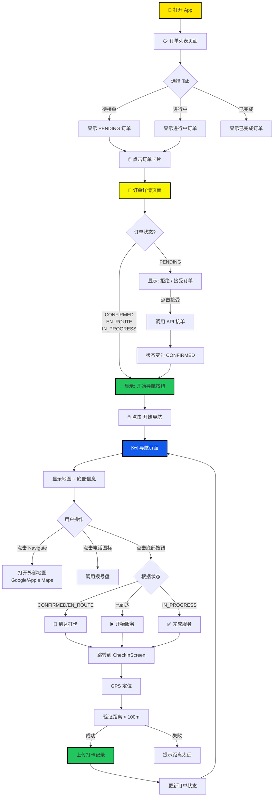
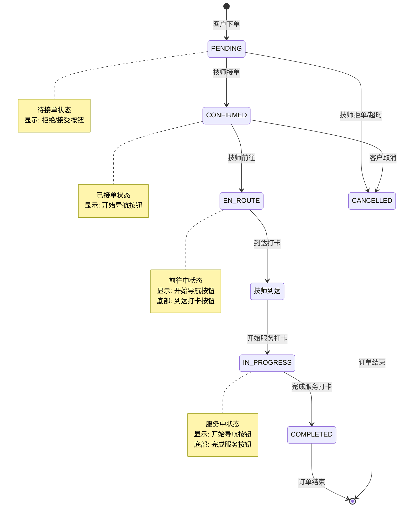
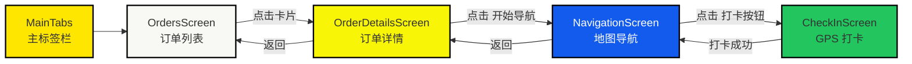
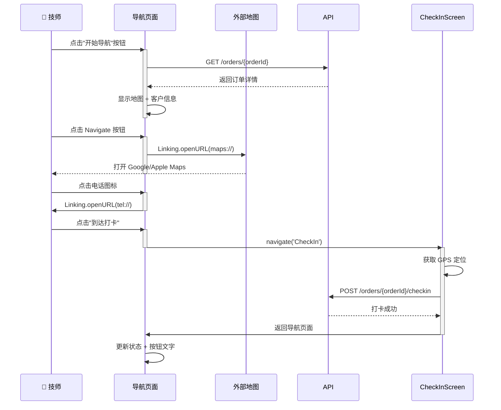
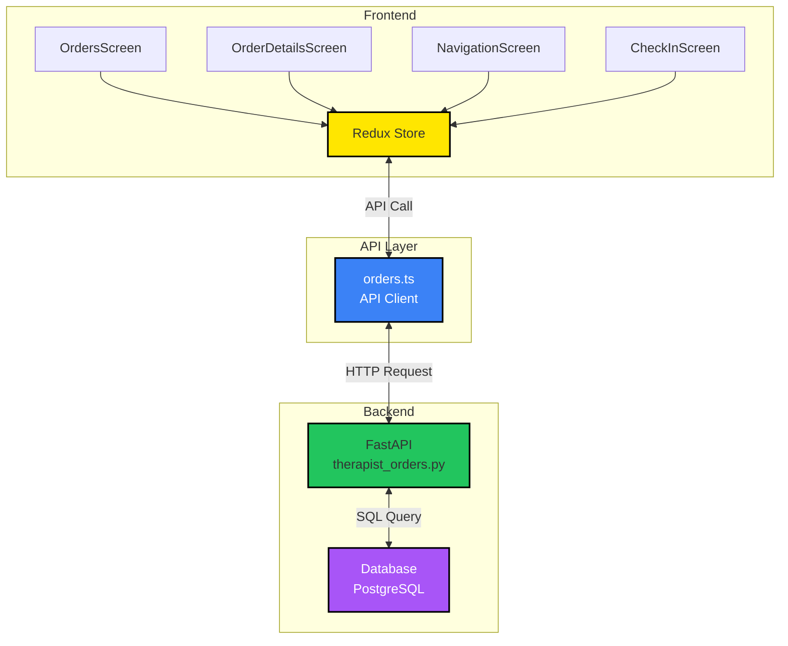
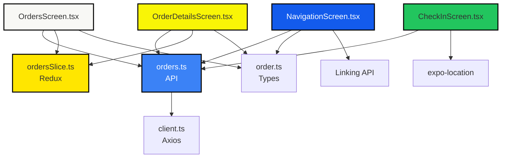

# 技师端订单导航流程图

## 用户操作流程



---

## 订单状态流转



---

## 页面导航关系



---

## 导航页面交互流程



---

## 数据流向



---

## 关键代码执行流程

```mermaid
flowchart TD
    A[用户点击订单卡片] --> B[navigation.navigate<br/>'OrderDetails',<br/>{orderId}]
    B --> C[OrderDetailsScreen<br/>useEffect]
    C --> D[loadOrderDetails]
    D --> E[ordersApi.getOrderDetail<br/>bookingId]
    E --> F[dispatch<br/>setCurrentOrder]
    F --> G{检查订单状态}
    
    G -->|CONFIRMED/<br/>EN_ROUTE/<br/>IN_PROGRESS| H[显示<br/>开始导航按钮]
    
    H --> I[用户点击<br/>开始导航]
    I --> J[navigation.navigate<br/>'Navigation',<br/>{orderId}]
    
    J --> K[NavigationScreen<br/>useEffect]
    K --> L[loadOrder]
    L --> M[ordersApi.getOrderDetail<br/>orderId]
    M --> N[setOrder]
    
    N --> O[渲染地图<br/>+ 客户信息<br/>+ 打卡按钮]
    
    O --> P{用户操作}
    P -->|Navigate| Q[handleNavigate]
    P -->|Call| R[handleCall]
    P -->|打卡| S[navigate<br/>'CheckIn']
    
    Q --> T[Linking.openURL<br/>maps://或geo://]
    R --> U[Linking.openURL<br/>tel://]
    S --> V[CheckInScreen]
    
    style A fill:#FFE600,stroke:#000,stroke-width:2px
    style H fill:#22C55E,stroke:#000,stroke-width:2px
    style O fill:#135BEC,color:#fff,stroke:#000,stroke-width:2px
    style V fill:#F97316,stroke:#000,stroke-width:2px
```

---

## 文件依赖关系



