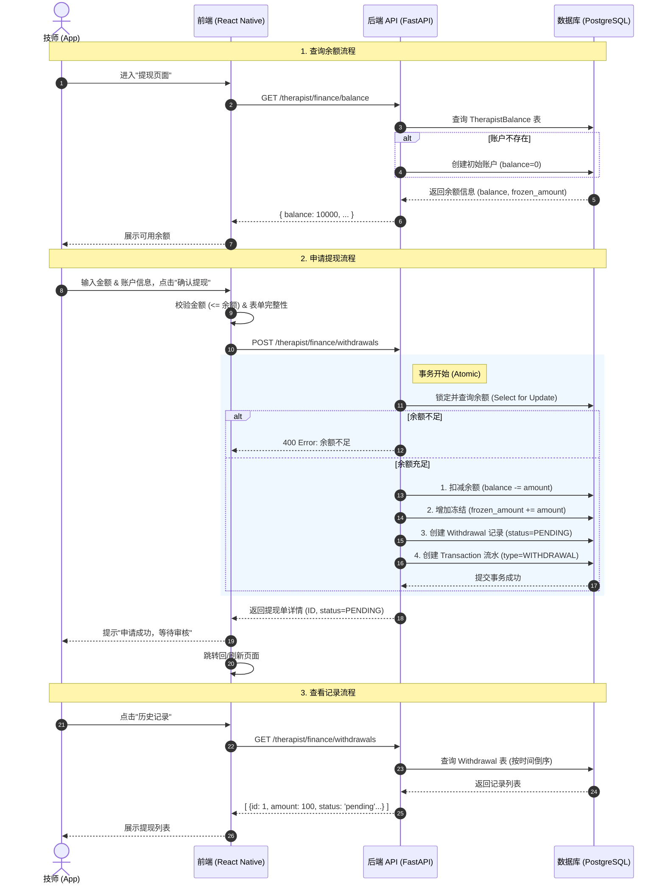
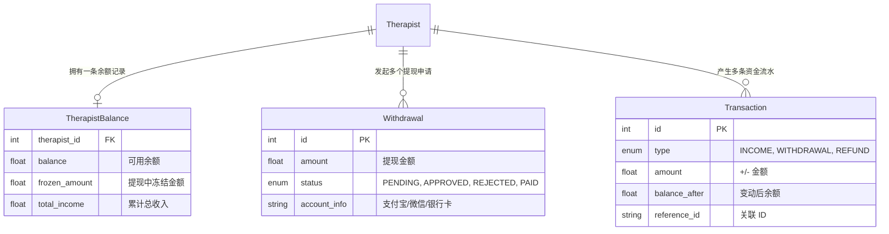

好的，这是提现功能（P1）的完整业务流程图，展示了从前端发起申请到后端处理的全过程，以及涉及的数据模型交互。

### 关键数据模型交互

这个流程图涵盖了我们刚刚实现的：
1.  **自动初始化账户**：查询余额时如果不存在则创建。
2.  **原子性事务**：提现时同时扣减余额、增加冻结、生成记录和流水，确保数据一致性。
3.  **状态管理**：提现状态流转（虽然目前只实现了申请 PENDING 之后的流程需要管理员后台操作，目前我们只实现了申请端）。